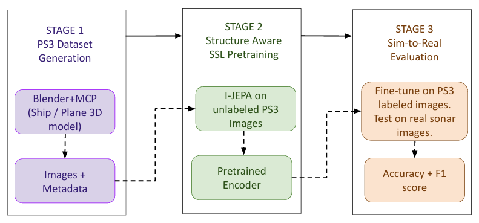

# PS3 Simulator — Physics-Parametrised Synthetic Sonar for Self-Supervised Sim-to-Real Transfer

[](https://macvi.org)
[](LICENSE)
[](https://python.org)
[](https://pytorch.org)

> **PS3 Simulator: Physics-Parametrised Synthetic Sonar for Self-Supervised Sim-to-Real Transfer**  
> Kamal Basha S, Athira Nambiar  
> MaCVi Workshop @ CVPR 2026

---
## 🖼️ Sample Images

<p align="center">
  
  
  
</p>

<p align="center">
  
  
</p>

## Overview

PS3 Simulator is a three-stage pipeline for sonar object classification **without any real sonar data at any training stage**:

```
Stage 1: PS3 Simulator Dataset Generation
         Blender + MCP → 1,008 synthetic SSS images
         Physics parameters: altitude, grazing angle, seabed texture

Stage 2: Structure-Aware SSL Pretraining  
         I-JEPA on 1,008 unlabeled PS3 images
         Learns geometric structure in latent space

Stage 3: Sim-to-Real Evaluation
         Fine-tune on labeled PS3 → Test on real KSLG/SCTD
         No real sonar data used at any training stage
```

---
## 🏗️ Architecture Overview



## Key Results

| Method | Pretrain | Acc (%) | ±Std | F1 |
|--------|----------|---------|------|-----|
| Random Init | None | 23.0 | ±0.9 | 0.239 |
| ImageNet Supervised | ImageNet | 76.8 | ±8.2 | 0.775 |
| DINO (ImageNet) | ImageNet | 78.8 | ±0.9 | 0.810 |
| DINO (PS3) | PS3 Synthetic | 58.8 | ±11.9 | 0.639 |
| **I-JEPA PS3 (Ours)** | **PS3 Synthetic** | **70.9** | **±4.5** | **0.733** |
| I-JEPA ImageNet† | ImageNet | 86.0 | ±0.1 | 0.796 |

†Upper bound — ViT-H/14, not directly comparable  
Train: Synthetic PS3 only | Test: 876 real KSLG/SCTD images

---

## Repository Structure

```
ps3-simulator/
│
├── README.md
├── LICENSE
├── requirements.txt
│
├── stage1_dataset/
│   ├── README.md
│   ├── blender_scripts/
│   │   └── blender_batch_render.py   ← dataset generation
│   ├── 3d_objects/                   ← ship and plane .blend files
│   └── seabed_textures/              ← sand and gravel textures
│
├── stage2_pretraining/
│   ├── README.md
│   ├── configs/
│   │   └── sonar_vits16.yaml         ← I-JEPA config
│   └── src/                          ← I-JEPA training source
│
├── stage3_evaluation/
│   ├── README.md
│   └── PS3_Stage2_Evaluation.ipynb   ← main evaluation notebook
│
├── results/
│   ├── tsne_final.png
│   ├── bar_chart.png
│   ├── fewshot_plot.png
│   └── results_final.json
│
└── assets/
    └── pipeline.png                  ← Figure 1 from paper
```

---

## Installation

```bash
git clone https://github.com/bashakamal/ps3-simulator
cd ps3-simulator
pip install -r requirements.txt
```

---

## Dataset

PS3 Simulator dataset (1,008 synthetic SSS images):

```
Download: [HuggingFace Dataset Link — coming soon]

Structure:
data/
├── train/
│   ├── ship/    (N images)
│   └── plane/   (N images)
├── val/
│   ├── ship/
│   └── plane/
└── test/        ← REAL sonar (KSLG + SCTD)
    ├── ship/
    └── plane/
```

---

## Pretrained Weights

Download from HuggingFace:
huggingface.co/kamalbasha/ps3-simulator

or in Python:
```python
from huggingface_hub import hf_hub_download

path = hf_hub_download(
    repo_id="kamalbasha/ps3-simulator",
    filename="jepa-ep200.pth.tar")
```

---

## Stage 1 — Dataset Generation

```bash
# Generate PS3 dataset using Blender
blender --background --python stage1_dataset/blender_scripts/blender_batch_render.py

# Physical parameters controlled:
# - Altitude: 50m, 70m, 100m
# - Grazing angle: varied
# - Seabed: sand, gravel
# - Object rotation: 0-360 degrees
```

---

## Stage 2 — I-JEPA Pretraining

```bash
cd stage2_pretraining
python main.py \
  --fname configs/sonar_vits16.yaml \
  --devices cuda:0
```

---

## Stage 3 — Evaluation

Open and run `stage3_evaluation/PS3_Stage2_Evaluation.ipynb`

Update paths in **Cell 2 — Configuration**:

```python
CFG = {
    'data_dir'      : 'path/to/ps3_data',
    'ijepa_ckpt'    : 'path/to/jepa-ep200.pth.tar',
    'dino_ps3_ckpt' : 'path/to/dino_checkpoint.pth',
    'ijepa_h_ckpt'  : 'path/to/IN1K-vit.h.14-300e.pth.tar',
    'output_dir'    : 'path/to/save/results',
}
```

Run all cells in order (Cell 1 → Cell 12).

---

## Requirements

```
torch>=2.0.0
torchvision>=0.15.0
timm>=0.9.0
numpy>=1.24.0
scikit-learn>=1.3.0
matplotlib>=3.7.0
seaborn>=0.12.0
Pillow>=9.5.0
```

---

## Citation

```bibtex
@inproceedings{basha2026ps3,
  title     = {PS3 Simulator: Physics-Parametrised Synthetic Sonar 
               for Self-Supervised Sim-to-Real Transfer},
  author    = {Basha, Kamal S; Athira Nambiar},
  booktitle = {MaCVi Workshop @ CVPR},
  year      = {2026}
}
```

---

## Acknowledgements

- [I-JEPA](https://github.com/facebookresearch/ijepa) — Facebook Research
- [DINO](https://github.com/facebookresearch/dino) — Facebook Research  
- [timm](https://github.com/huggingface/pytorch-image-models) — HuggingFace
- [SeabedObjects-KLSG](https://github.com/mvaldenegro/marine-debris-fls-datasets) — test dataset
- [Blender MCP](https://github.com/ahujasid/blender-mcp) — 3D generation

---

## License

MIT License — see [LICENSE](LICENSE)
